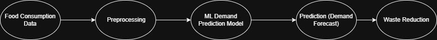
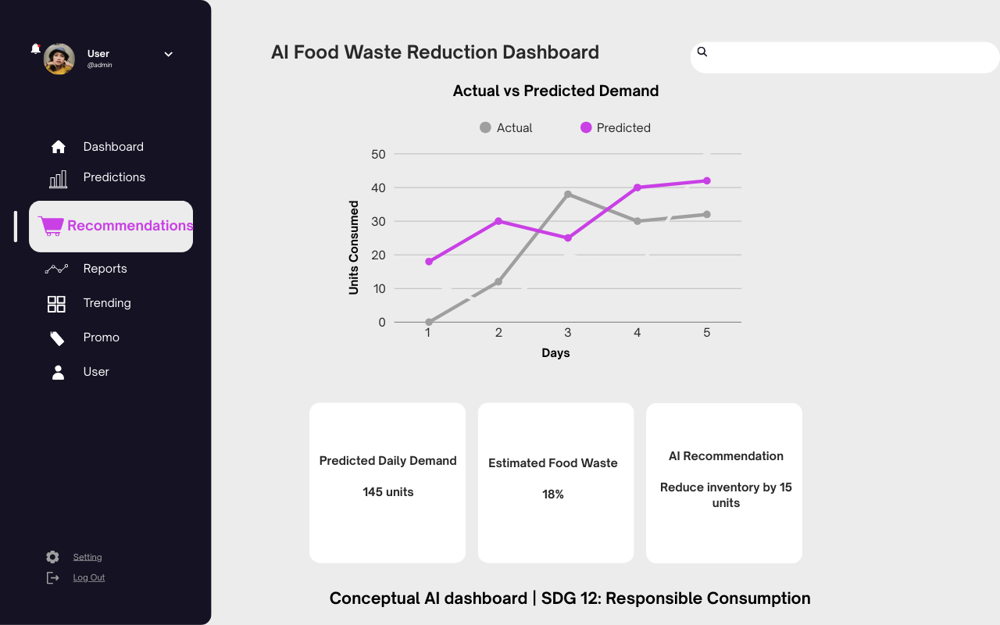

# AI-Based Food Waste Reduction System (SDG 12)

## Overview
This project demonstrates how Artificial Intelligence can be used to reduce food waste by predicting consumption patterns and supporting sustainable decision-making.

Aligned with **UN SDG 12: Responsible Consumption and Production**.

## Problem Statement
Food waste occurs due to poor demand forecasting and lack of data-driven planning. This leads to economic loss and increased environmental impact.

## Solution
An AI-based system that:
- Analyzes historical food consumption data
- Predicts future demand using machine learning
- Provides recommendations to reduce over-purchasing and waste

## Visual Overview

### System Architecture

### Conceptual Dashboard View

## AI Technologies Used
- Machine Learning (Regression)
- Python
- Pandas, NumPy
- Scikit-learn

## Target Users
- Households
- Small food vendors
- Restaurants and cafeterias

## Project Status
Conceptual project with sample implementation and ML workflow.

## SDG Alignment
- SDG 12: Responsible Consumption and Production
- SDG 13: Climate Action
